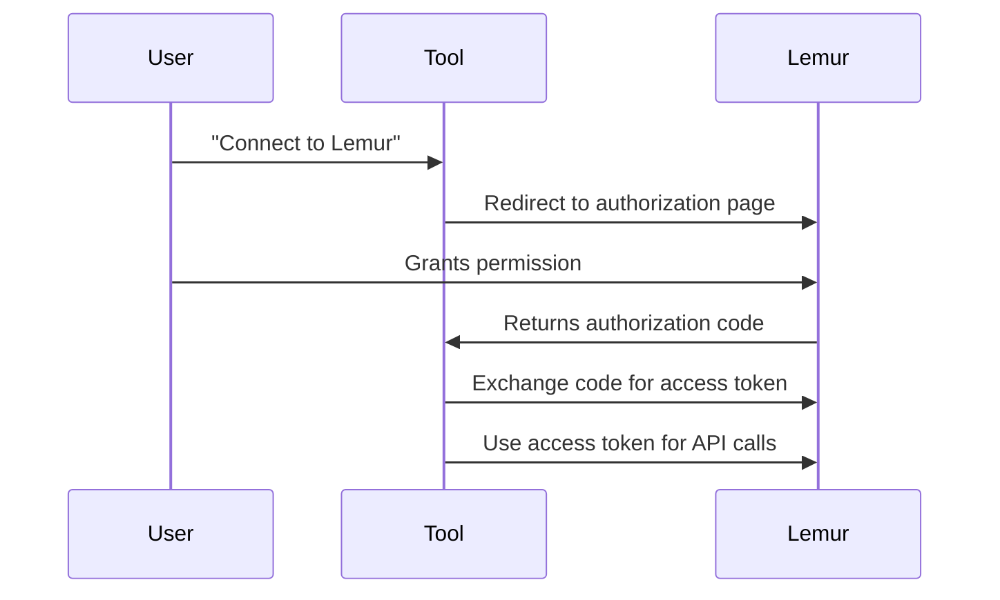

# Service Authentication - Tools Acting on Behalf of Users

## Overview

This document explains how external tools, services, or applications can authenticate with Lemur to perform operations on behalf of users.

## Authentication Patterns

### Pattern 1: User Login Flow (Interactive)

**Use Case:** CLI tools, desktop applications, browser extensions

The tool prompts the user for credentials, then uses those credentials to obtain a JWT token.

```bash
# Tool prompts user for username/password
read -p "Username: " USERNAME
read -sp "Password: " PASSWORD

# Tool obtains JWT token
JWT_TOKEN=$(curl -k -s -X POST "https://localhost:8447/api/1/auth/login" \
  -H "Content-Type: application/json" \
  -d "{\"username\": \"$USERNAME\", \"password\": \"$PASSWORD\"}" | \
  python3 -c "import sys, json; print(json.load(sys.stdin)['token'])")

# Tool stores token for subsequent requests
echo "$JWT_TOKEN" > ~/.my-tool/lemur-token

# Tool uses token for API calls
curl -k -H "Authorization: Bearer $JWT_TOKEN" \
  "https://localhost:8447/api/1/certificates"
```

**Pros:**
- Simple to implement
- Uses standard authentication
- Token expires automatically (24 hours default)

**Cons:**
- User must provide credentials to the tool
- Token must be refreshed after expiration
- Not suitable for long-running services

---

### Pattern 2: Service Account (Recommended for Services)

**Use Case:** Automated services, CI/CD pipelines, background workers

Create a dedicated service account user for each tool/service.

#### Step 1: Create Service Account

```bash
# Create a service account user
docker exec -i local-lemur python3 << 'EOF'
from lemur.factory import create_app
from lemur.users import service as user_service
from lemur.roles import service as role_service

app = create_app()
with app.app_context():
    # Create role for the service
    role = role_service.create(
        name="certificate-manager-service",
        description="Service role for Certificate Manager tool",
        username="admin"
    )
    
    # Create service account
    user = user_service.create(
        username="cert-manager-svc",
        email="cert-manager-svc@example.com",
        password="strong-random-password-here",
        active=True,
        roles=[role]
    )
    
    print(f"✓ Service account created: {user.username} (ID: {user.id})")
    print(f"  Email: {user.email}")
    print(f"  Role: {role.name}")
EOF
```

#### Step 2: Generate Long-Lived Token

```bash
# Generate a long-lived token (1 year) for the service account
docker exec -i local-lemur python3 /opt/lemur/local/jwt_auth_helper.py generate \
  --user-id 2 \
  --email "cert-manager-svc@example.com" \
  --roles "certificate-manager-service" \
  --hours 8760  # 1 year

# Output: eyJhbGciOiJIUzI1NiIsInR5cCI6IkpXVCJ9...
```

#### Step 3: Tool Configuration

```yaml
# config.yaml for your tool
lemur:
  base_url: https://lemur.example.com/api/1
  service_token: eyJhbGciOiJIUzI1NiIsInR5cCI6IkpXVCJ9...
  
# Tool reads config and uses service_token for all API calls
```

**Pros:**
- Dedicated credentials per service
- Long-lived tokens
- Can be revoked by disabling service account
- Audit trail shows which service performed actions

**Cons:**
- Requires manual token rotation
- Token stored in configuration

---

### Pattern 3: API Key System (Future Enhancement)

**Use Case:** Third-party integrations, webhooks, external services

**Note:** This would require implementing an API key system in Lemur. Here's how it would work:

```bash
# User generates API key via UI or CLI
lemur api-key create --name "Certificate Manager" --expires-in 365d

# Output:
# API Key: lmr_sk_1234567890abcdef...
# Key ID: key_abc123
# Expires: 2027-01-21
```

```bash
# Tool uses API key instead of JWT
curl -k -H "X-API-Key: lmr_sk_1234567890abcdef..." \
  "https://localhost:8447/api/1/certificates"
```

**Pros:**
- Easy to generate and revoke
- Can have granular scopes/permissions
- Standard pattern for API integrations

**Cons:**
- Requires implementation in Lemur (not currently available)

---

### Pattern 4: OAuth2 Delegation (Enterprise)

**Use Case:** Third-party applications that need user authorization

**Note:** This would require OAuth2 provider integration. High-level flow:



**Implementation Example (Conceptual):**
```python
# Tool redirects user to:
# https://lemur.example.com/oauth/authorize?
#   client_id=cert-manager&
#   redirect_uri=https://tool.example.com/callback&
#   scope=certificates:read,certificates:write

# After user authorizes, tool receives code and exchanges it:
token_response = requests.post(
    'https://lemur.example.com/oauth/token',
    data={
        'grant_type': 'authorization_code',
        'code': authorization_code,
        'client_id': 'cert-manager',
        'client_secret': 'secret',
        'redirect_uri': 'https://tool.example.com/callback'
    }
)

access_token = token_response.json()['access_token']
```

**Pros:**
- User explicitly authorizes the tool
- Can have limited scopes
- Industry standard
- Tokens can be refreshed

**Cons:**
- Complex to implement
- Requires OAuth2 provider in Lemur

---

## Current Best Practice (With Existing Lemur)

### For Interactive Tools (CLI, Desktop Apps)

**Option A: Store Token After Login**

```python
#!/usr/bin/env python3
"""
Example CLI tool that authenticates with Lemur
"""
import requests
import json
import os
from pathlib import Path

CONFIG_DIR = Path.home() / '.my-lemur-tool'
TOKEN_FILE = CONFIG_DIR / 'token'

def login(base_url, username, password):
    """Login and store JWT token"""
    response = requests.post(
        f'{base_url}/auth/login',
        json={'username': username, 'password': password},
        verify=False  # Only for local dev
    )
    token = response.json()['token']
    
    # Store token
    CONFIG_DIR.mkdir(exist_ok=True)
    TOKEN_FILE.write_text(token)
    os.chmod(TOKEN_FILE, 0o600)  # Secure permissions
    
    return token

def get_token():
    """Get stored token or prompt for login"""
    if TOKEN_FILE.exists():
        return TOKEN_FILE.read_text().strip()
    
    # Prompt for credentials
    username = input('Lemur Username: ')
    password = getpass.getpass('Lemur Password: ')
    base_url = 'https://localhost:8447/api/1'
    
    return login(base_url, username, password)

def list_certificates():
    """List certificates using stored token"""
    token = get_token()
    
    response = requests.get(
        'https://localhost:8447/api/1/certificates',
        headers={'Authorization': f'Bearer {token}'},
        verify=False
    )
    
    if response.status_code == 401:
        # Token expired, re-login
        TOKEN_FILE.unlink(missing_ok=True)
        return list_certificates()
    
    return response.json()

# Usage
if __name__ == '__main__':
    certs = list_certificates()
    print(f"Found {certs['total']} certificates")
```

**Option B: Prompt for Token**

```python
def configure():
    """One-time configuration"""
    print("Login to Lemur to get your token:")
    print("1. Run: curl -k -X POST https://localhost:8447/api/1/auth/login \\")
    print("         -H 'Content-Type: application/json' \\")
    print("         -d '{\"username\": \"your-user\", \"password\": \"your-pass\"}'")
    print()
    token = input("Paste your token here: ")
    
    CONFIG_DIR.mkdir(exist_ok=True)
    TOKEN_FILE.write_text(token)
    os.chmod(TOKEN_FILE, 0o600)
    
    print("✓ Configuration saved!")
```

### For Services/Automation

**Create Dedicated Service Account with Long-Lived Token**

```bash
# 1. Create service account
docker exec -i local-lemur python3 << 'EOF'
from lemur.factory import create_app
from lemur.users import service as user_service

app = create_app()
with app.app_context():
    user = user_service.create(
        username="automation-service",
        email="automation@example.com",
        password="$(openssl rand -base64 32)",
        active=True
    )
    print(f"Service User ID: {user.id}")
EOF

# 2. Generate long-lived token (5 years for automation)
docker exec -i local-lemur python3 /opt/lemur/local/jwt_auth_helper.py generate \
  --user-id 3 \
  --email "automation@example.com" \
  --hours 43800 \
  > /opt/automation/lemur-token

# 3. Use in automation scripts
LEMUR_TOKEN=$(cat /opt/automation/lemur-token)

curl -k -H "Authorization: Bearer $LEMUR_TOKEN" \
  "https://localhost:8447/api/1/certificates"
```

---

## Security Considerations

### Token Storage

**Good Practices:**
- Store tokens in user's home directory with `0600` permissions
- Use OS keychain/credential manager when available:
  - macOS: Keychain Access
  - Linux: GNOME Keyring, KWallet
  - Windows: Credential Manager
- Environment variables for CI/CD (with secrets management)

**Bad Practices:**
- ❌ Hardcoding tokens in source code
- ❌ Committing tokens to Git
- ❌ World-readable token files
- ❌ Sharing tokens between services

### Token Rotation

```bash
# Automate token rotation for long-running services
#!/bin/bash
# rotate-lemur-token.sh

TOKEN_FILE="/opt/service/lemur-token"
TOKEN_AGE_DAYS=$(( ($(date +%s) - $(stat -f %m "$TOKEN_FILE")) / 86400 ))

if [ $TOKEN_AGE_DAYS -gt 180 ]; then
    echo "Token is ${TOKEN_AGE_DAYS} days old, rotating..."
    
    # Re-authenticate
    NEW_TOKEN=$(curl -k -s -X POST "https://localhost:8447/api/1/auth/login" \
      -H "Content-Type: application/json" \
      -d "{\"username\": \"$SERVICE_USER\", \"password\": \"$SERVICE_PASS\"}" | \
      jq -r '.token')
    
    echo "$NEW_TOKEN" > "$TOKEN_FILE"
    chmod 600 "$TOKEN_FILE"
    
    echo "✓ Token rotated"
fi
```

### Audit Logging

All API calls include the user context from the JWT token. Check audit logs:

```bash
# View who performed actions
docker exec -i local-lemur python3 << 'EOF'
from lemur.factory import create_app
from lemur.logs.models import Log

app = create_app()
with app.app_context():
    recent_logs = Log.query.order_by(Log.id.desc()).limit(10).all()
    for log in recent_logs:
        print(f"{log.logged_at} - User {log.user_id}: {log.log_type}")
EOF
```

---

## Example Tool Implementation

### Complete Example: Certificate Management CLI

```python
#!/usr/bin/env python3
"""
lemur-cli - Command-line tool for Lemur certificate management
"""

import requests
import json
import sys
from pathlib import Path
import getpass

class LemurClient:
    def __init__(self, base_url, token=None):
        self.base_url = base_url
        self.token = token
        self.token_file = Path.home() / '.lemur-cli' / 'token'
    
    def login(self, username=None, password=None):
        """Authenticate and store token"""
        if not username:
            username = input('Username: ')
        if not password:
            password = getpass.getpass('Password: ')
        
        response = requests.post(
            f'{self.base_url}/auth/login',
            json={'username': username, 'password': password},
            verify=False
        )
        
        if response.status_code != 200:
            raise Exception(f"Login failed: {response.text}")
        
        self.token = response.json()['token']
        
        # Save token
        self.token_file.parent.mkdir(exist_ok=True)
        self.token_file.write_text(self.token)
        self.token_file.chmod(0o600)
        
        print("✓ Logged in successfully")
        return self.token
    
    def _get_token(self):
        """Get token from file or prompt for login"""
        if self.token:
            return self.token
        
        if self.token_file.exists():
            self.token = self.token_file.read_text().strip()
            return self.token
        
        print("No saved credentials found. Please login:")
        return self.login()
    
    def _request(self, method, endpoint, **kwargs):
        """Make authenticated request"""
        headers = kwargs.pop('headers', {})
        headers['Authorization'] = f'Bearer {self._get_token()}'
        
        response = requests.request(
            method,
            f'{self.base_url}/{endpoint}',
            headers=headers,
            verify=False,
            **kwargs
        )
        
        if response.status_code == 401:
            # Token expired, re-login
            print("Token expired. Please login again:")
            self.token = None
            self.token_file.unlink(missing_ok=True)
            return self._request(method, endpoint, **kwargs)
        
        return response
    
    def list_certificates(self):
        """List all certificates"""
        response = self._request('GET', 'certificates')
        return response.json()
    
    def create_destination(self, label, description, plugin_slug, options):
        """Create a new destination"""
        response = self._request('POST', 'destinations', json={
            'label': label,
            'description': description,
            'plugin': {'slug': plugin_slug},
            'options': options
        })
        return response.json()

def main():
    client = LemurClient('https://localhost:8447/api/1')
    
    if len(sys.argv) < 2:
        print("Usage: lemur-cli <command>")
        print("Commands: login, list-certs, create-dest")
        sys.exit(1)
    
    command = sys.argv[1]
    
    if command == 'login':
        client.login()
    
    elif command == 'list-certs':
        certs = client.list_certificates()
        print(f"Total certificates: {certs['total']}")
        for cert in certs.get('items', []):
            print(f"  • {cert['name']} (ID: {cert['id']})")
    
    elif command == 'create-dest':
        dest = client.create_destination(
            label='My AWS Destination',
            description='Created via CLI',
            plugin_slug='aws-destination',
            options={'accountNumber': '123456789012'}
        )
        print(f"✓ Created destination: {dest['label']} (ID: {dest['id']})")

if __name__ == '__main__':
    main()
```

**Usage:**
```bash
# First time - login
./lemur-cli login

# Subsequent uses - token is cached
./lemur-cli list-certs
./lemur-cli create-dest
```

---

## Summary Comparison

| Pattern | Complexity | Security | Use Case | Currently Available |
|---------|-----------|----------|----------|-------------------|
| User Login Flow | Low | Medium | CLI tools, desktop apps | ✅ Yes |
| Service Account | Low | High | Automation, CI/CD | ✅ Yes |
| API Keys | Medium | High | Third-party integrations | ❌ No (future) |
| OAuth2 | High | Highest | SaaS integrations | ❌ No (future) |

## Recommended Approach

1. **For Interactive Tools:** Use Pattern 1 (User Login Flow) with token caching
2. **For Services/Automation:** Use Pattern 2 (Service Account) with long-lived tokens
3. **For Production:** Consider implementing API Keys (Pattern 3) for better management

## Related Documentation

- [JWT_API_USAGE.md](JWT_API_USAGE.md) - JWT token generation
- [INTEGRATION_TEST_CONNECTION.md](INTEGRATION_TEST_CONNECTION.md) - API connection details
- [API_CERT_WITH_DESTINATIONS.md](API_CERT_WITH_DESTINATIONS.md) - API usage examples
